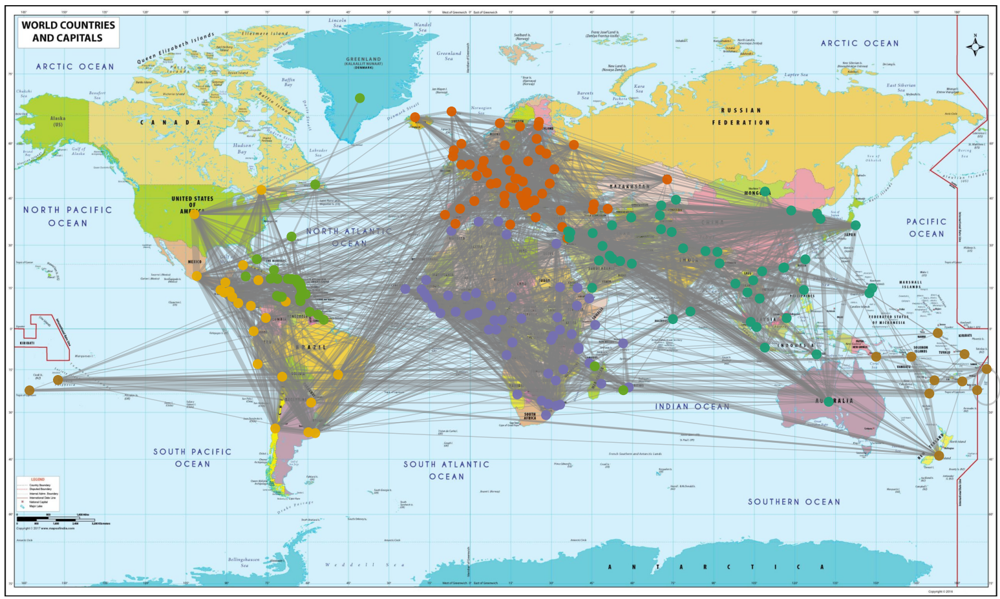

# Weighted Random Dot Product Graphs



This repository contains the code accompanying the paper **"Weighted Random Dot Product Graphs"** (B. Marenco, P. Bermolen, M. Fiori, F. Larroca and G. Mateos, soon to be on arXiv).

It includes implementations of the methods and experiments described in the paper, including the proposed Weighted RDPG model (built upon [Graspologic’s implementation of the standard RDPG](https://github.com/graspologic-org/graspologic/blob/main/graspologic/models/rdpg.py)) and the novel primal-dual optimization approach for maximum entropy inference under moment constraints.

## Installation

To reproduce the main results from the paper, follow the instructions below:

```bash
# Clone the repository
git clone https://github.com/bmarenco/wrdpg.git
cd wrdpg

# (Optional) Create and activate a virtual environment
python -m venv venv
source venv/bin/activate  # or venv\Scripts\activate on Windows

# Install dependencies
pip install -r requirements.txt

```

## Usage

To generate **Figures 3,4 and 5** from the paper, run:

```bash
python wrdpg_examples.py
```

To generate **Figure 7** , run:

```bash
python wrdpg_discrete_distribution_generation.py
```

To generate **Figure 8**, run:
```bash
python wrdpg_continuous_distribution_generation.py
```

To generate **Figures 9, 10, and 11**, first modify the `football_data_dir` parameter in `football_discrete_distribution.py` to point to a valid path on your system, then run:

```bash
python football_discrete_distribution.py
```

To generate **Figure 12**, first clone the [PyMaxEnt repository](https://github.com/saadgroup/PyMaxEnt). Then run:

```bash
python maximum_entropy_example.py
```
